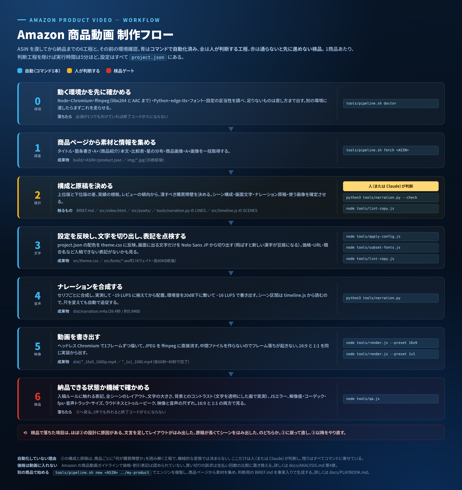

# いきなりPDF Ver.13 COMPLETE — Amazon 商品動画

ASIN **B0FVFTZSM7** 向けの商品動画。HTML/CSS/JS でアニメーションを組み、
ヘッドレス Chromium で 1 フレームずつキャプチャして H.264 の MP4 に書き出す。

| | 16:9 | 1:1 |
|---|---|---|
| 解像度 | 1920×1080 | 1080×1080 |
| 尺 | 39.4秒 | 39.4秒 |
| fps | 30 | 30 |
| 映像 | H.264 High / yuv420p | H.264 High / yuv420p |
| 音声 | 日本語ナレーション AAC 48kHz / -16 LUFS | 同左 |
| サイズ | 約11MB | 約7MB |

出力先: `dist/`

- [`docs/PLAYBOOK.md`](docs/PLAYBOOK.md) — **別の人・別の商品で同じ品質を出すために何が要るか**
- [`docs/WORKFLOW.md`](docs/WORKFLOW.md) — 制作フロー。他の商品で回すときの手順もここ
- [`docs/ANALYSIS.md`](docs/ANALYSIS.md) — 商品ページ・A+ の分析と、動画構成の根拠
- [`docs/SCRIPT.md`](docs/SCRIPT.md) — 絵コンテ・台本・ナレーション原稿



---

## 動かす

```bash
npm install                # playwright と ffmpeg を入れる
pip install edge-tts       # 音声合成

tools/pipeline.sh doctor   # 必要なものが揃っているか（足りなければ直し方が出る）
tools/pipeline.sh build    # 設定反映 → 文字 → 表記点検 → ナレーション → 映像
tools/pipeline.sh qa       # 検品
```

`doctor` は Node・Chromium・ffmpeg（libx264 と AAC の有無まで）・Python・edge-tts・
フォント・設定の妥当性を調べる。必須が1つでも欠けると終了コードが 0 にならない。

個別に叩くなら次のとおり。

```bash
node tools/subset-fonts.js             # フォントのサブセット化
python3 tools/narration.py             # dist/narration.m4a を作る
node tools/render.js --preset 16x9     # 映像 + ナレーションで書き出す
node tools/render.js --preset 1x1
node tools/qa.js                       # 検品
```

ナレーションは `dist/narration.m4a` があれば自動で多重化される。
無ければ無音トラックになり、その旨が警告に出る。

## 別の商品で作る

```bash
tools/pipeline.sh new B0XXXXXXXX ../my-product
```

エンジン一式・図版・ドキュメントを複製し、`project.json` の ASIN と slug を差し替え、
商品ページから素材を集め、判断用の `BRIEF.md` を事実入りで生成する。
前の商品の画像・書き出し・根拠つき主張は引き継がない。

| コマンド | 内容 |
|---|---|
| `tools/pipeline.sh doctor` | 動く環境か確かめる |
| `tools/pipeline.sh fetch <ASIN>` | 商品ページから素材と情報を集める |
| `tools/pipeline.sh build` | 設定反映・文字・表記点検・ナレーション・映像 |
| `tools/pipeline.sh qa` | 検品 |
| `tools/pipeline.sh new <ASIN> <dir>` | 別の商品のプロジェクトを作る |
| `tools/pipeline.sh all <ASIN>` | 環境確認と調査を済ませ、設計工程の指示を出して止まる |

## 設定

配色・尺・声・検品の基準は [`project.json`](project.json) にまとまっている。
ツールはすべてここを読むので、書き換える場所を探す必要がない。
矛盾した設定（たとえばナレーションの目標音量が検品の基準の外）は、書き出す前に止まる。

```
project.json
├── product      ASIN・商品名・slug（書き出しファイル名になる）
├── theme        配色とフォント → node tools/apply-config.js で src/theme.css に反映
├── video        fps・画質・プリセット・納品するもの
├── narration    声・速度・音量・環境音
├── qa           検品の基準値
└── compliance   使うルールと、根拠を示した主張
```

その他のオプション:

```bash
node tools/render.js --preset 9x16              # 縦型 1080×1920
node tools/render.js --w 1280 --h 720 --fps 30  # 任意サイズ
node tools/render.js --crf 20 --out dist/a.mp4  # 画質と出力先を指定
node tools/render.js --audio none               # ナレーションを入れず無音にする
```

環境変数で実行ファイルを差し替えられる。

- `CHROMIUM_PATH` — 既定は `/opt/pw-browsers/chromium`、なければ Playwright 同梱版
- `FFMPEG_PATH` — 既定は `@ffmpeg-installer/ffmpeg`

レンダリングはフレームをディスクに書かず、JPEG を ffmpeg の標準入力へ直接流している。
1920×1080 / 1020フレームで約60秒。

---

## 中身を編集する

| 変えたいもの | 触るファイル |
|---|---|
| 文言・構成要素 | `src/video.html` |
| 出るタイミング・動き・尺 | `src/timeline.js` |
| 色・文字サイズ・レイアウト | `src/styles.css` |
| 製品画面・パッケージ画像 | `src/assets/*.jpg` |
| ナレーション原稿・声・速度 | `tools/narration.py` |
| 配色・尺・声・検品の基準 | `project.json` |
| 入稿できない表記のルール | `docs/compliance/*.json` |
| フロー図・役割分担図 | `docs/diagrams/*.html` |

`src/video.html` をそのままブラウザで開くとループ再生でプレビューできる。

### 仕組み

CSS の transition / animation は一切使っていない。
`render(t)` が時刻 `t` からすべての要素の opacity と transform を計算する純関数になっていて、
レンダラは `window.__video.seekFrame(n)` を呼んでから撮る。
これでフレームの取りこぼしや中途半端な補間が起きない。

```
window.__video = { fps, duration, frames, seek(t), seekFrame(n) }
```

### 尺を変える

`src/timeline.js` の `DUR` と `SCENES` の `a` / `b`（各シーンの開始・終了秒）を変える。
シーンは 0.34 秒かけてフェードインし、0.30 秒かけてフェードアウトする。

**シーン区間は `src/timeline.js` が唯一の正。**
`tools/narration.py` はそこから区間を読み出して各セリフを配置するので、
尺を変えたらナレーションを作り直すだけで自動的に追従する。

```bash
python3 tools/narration.py --check   # セリフがシーンに収まるかだけ確認
```

---

## ナレーション

| | |
|---|---|
| 音声合成 | edge-tts（Microsoft Edge のニューラル音声） |
| 声 | `ja-JP-NanamiNeural`（女性）。`--voice ja-JP-KeitaNeural` で男性 |
| 速度 | `+6%` |
| ラウドネス | -16 LUFS / トゥルーピーク -5 dBFS |
| 環境音 | 自前で合成した控えめなパッド。ナレーションの約 20 dB 下 |

```bash
python3 tools/narration.py                      # 既定の設定で作る
python3 tools/narration.py --voice ja-JP-KeitaNeural
python3 tools/narration.py --rate +10%          # 速く読ませる
python3 tools/narration.py --no-music           # 環境音を入れない
python3 tools/narration.py --music-db -24       # 環境音をもっと下げる
```

`--check` は各セリフの長さを実測して、シーンの終わりをはみ出さないかを表に出す。
原稿を書き換えたら必ずこれを通すこと。

### 音まわりの落とし穴（踏んだので残す）

- **`amix` は入力が終わるたびに残りを再正規化する。** 短いセリフを並べると
  全体に右肩上がりのゲインがかかる（実測で 12.9 dB の差）。だからミックスは
  ffmpeg ではなく Python で足し合わせている。
- **`alimiter` は `level`（自動レベル）が既定でオン。** 必ず `level=disabled` にする。
- **`apad` は無限に音を作り続ける。** 尺は出力側の `-t` で切る。`atrim` 任せだと
  ffmpeg が終了しない。
- 音量は動的な正規化（`loudnorm`）に任せず、実測して静的ゲインで当てている。
  セリフ間の音量差は 1.1 dB に収まっている。

### レイアウトが崩れていないか確かめる

`1rem = キャンバス幅の1%` に固定してあるので、16:9 と 1:1 で同じ比率のレイアウトになる。
文言を長くしたときは、各シーンの中身が余白の内側に収まっているか確認すること。
`docs/ANALYSIS.md` の入稿仕様表も合わせて見直す。

---

## 注意

- **価格は動画に入れていない。** 理由は `docs/ANALYSIS.md` 第4章。
- **実績数値の注記（※1・※3）を消さないこと。** 自社調べの数値なので、調査主体・対象・期間の表示が要る。
- 画像素材は商品ページ掲載画像から切り出したもの。公開前に権利関係を確認すること。
- 環境音は自前で合成した original の音。既成曲は使っていないので権利処理は不要。
- **ミュートでも成立するように作ってある。** 伝えたいことはすべて画面文字に出ている
  ので、ナレーションは補助。音声を外しても情報は欠けない。
- フォントは Noto Sans JP（SIL Open Font License 1.1）。使用文字だけをサブセット化して `src/fonts/` に同梱している。
  文言に新しい漢字を足したときは、サブセットを作り直さないと豆腐になる。

### 表記を点検する

```bash
node tools/lint-copy.js            # 価格・URL・競合名・根拠なしの最上級など
node tools/lint-copy.js --strict   # 要確認も失格にする
node tools/lint-copy.js --selftest # ルール自体が壊れていないか
```

ルールは `docs/compliance/<profile>.json`。各ルールに「拾うべき例」と
「拾ってはいけない例」を書いてあるので、正規表現を直しても自己診断で気づける。

### フォントのサブセットを作り直す

```bash
node tools/subset-fonts.js             # 動画本編 → src/fonts/
node tools/subset-fonts.js --diagrams  # 図版     → docs/diagrams/fonts/
```

対象ファイルに出てくる文字を集めて Google Fonts から取り直し、
woff2・`fonts.css`・`subset-chars.txt` を更新する。

### 図を作り直す

```bash
node tools/render-diagrams.js          # docs/diagrams/*.html → docs/*.png
node tools/render-diagrams.js workflow # 1枚だけ
```

図の原本は `docs/diagrams/` の HTML。2倍解像度で撮っている。
文言に新しい漢字を足したときは、先に `--diagrams` でフォントを作り直すこと。
